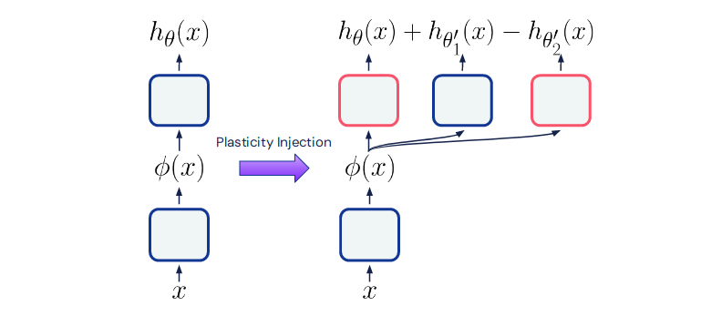
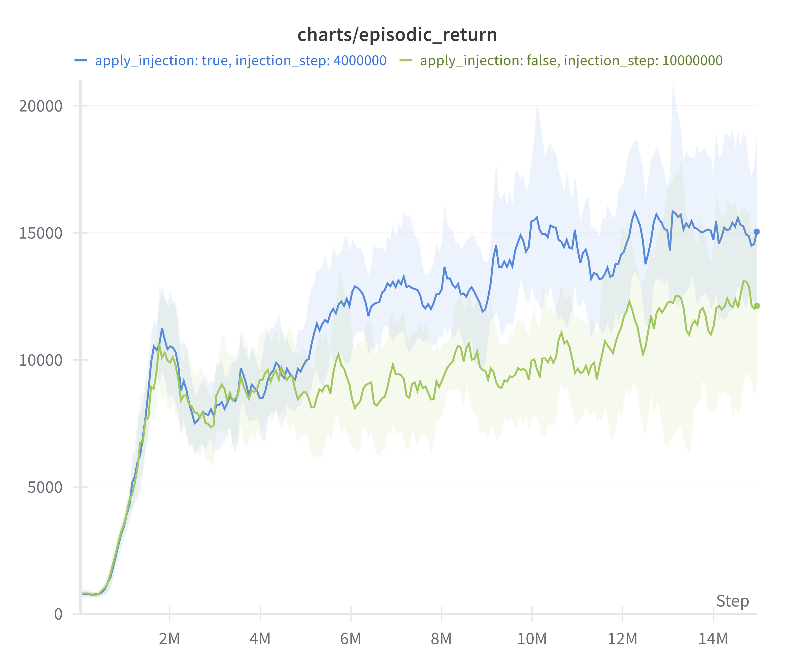

## Plasticity Injection

<p align="center">
    
</p>

Pytorch reimplementation of the [Plasticity injection](https://arxiv.org/abs/2305.15555) (Deep Reinforcement Learning with Plasticity Injection).
Plasticity injection serves two purposes: First, it can detect whether a network has lost plasticity by applying it at some point throughout the training.
Second, it improves the sample efficiency of agents that have lost their plasticity without the performance decline concomitant with resets.

## Applying the plasticity injection intervention to a DQN agent

Plasticity injection adheres to two desiderata:

1. It should not change the number of trainable parameters of the agent.
2. It should not change the agent's output after the injection.

The following algorithm meets these criteria:

1. *Freeze* the parameters $\theta$ of the current Q-function head.
2. Create two instances of **new parameters** $\theta^\prime~.$
3. Keep the first instance of $\theta^\prime$ learnable: $\theta^\prime_1~.$
4. *Freeze* the second instance of $\theta^\prime: \theta^\prime_2~.$  
   Adding these **frozen parameters**  $\theta^\prime_2$ ensures that the network's output at step $t$ where the intervention is performed is not changed.

The agent's Q-function is then defined as:

```math
Q(s) = \underbrace{h_\theta (s)}_{\text{frozen}} + \underbrace{h_{\theta_1^\prime} (s)}_{\text{learnable}} - \underbrace{h_{\theta_2^\prime} (s)}_{\text{frozen}}
```

## Implementation notes

- The code allows all three heads to be trainable instead of just $h_{\theta_1^\prime} (s)$, corresponding to one of the ablations in the appendix.
- Gradients from the frozen heads are still propagated back to the encoder, in line with the paper.
- The target network must also be reset to mirror the agent's Q network.
- Adding a new parameter group to the optimizer didn't work for me, so I added all parameters before the training and freeze/unfreeze them as needed.
- The authors used RMSProp instead of Adam and provide an ablation in Figure 9 of the appendix for whether it makes sense to reset the optimizer state. They find it hurts performance; therefore, I'm not resetting the Adam moments.

## Results on Phoenix

Phoenix is a game where plasticity is lost early in training. My results are not an exact reproduction of the paper because 200M experiments on Atari are too expensive.

<p align="center">
    
</p>

## Citations

Paper:

```bibtex
@article{nikishin2024deep,
  title={Deep reinforcement learning with plasticity injection},
  author={Nikishin, Evgenii and Oh, Junhyuk and Ostrovski, Georg and Lyle, Clare and Pascanu, Razvan and Dabney, Will and Barreto, Andr{\'e}},
  journal={Advances in Neural Information Processing Systems},
  volume={36},
  year={2024}
}
```

Training code is based on [cleanRL](https://github.com/vwxyzjn/cleanrl):

```bibtex
@article{huang2022cleanrl,
  author  = {Shengyi Huang and Rousslan Fernand Julien Dossa and Chang Ye and Jeff Braga and Dipam Chakraborty and Kinal Mehta and João G.M. Araújo},
  title   = {CleanRL: High-quality Single-file Implementations of Deep Reinforcement Learning Algorithms},
  journal = {Journal of Machine Learning Research},
  year    = {2022},
  volume  = {23},
  number  = {274},
  pages   = {1--18},
  url     = {http://jmlr.org/papers/v23/21-1342.html}
}
```

Replay buffer and wrappers are from [Stable Baselines 3](https://github.com/DLR-RM/stable-baselines3):

```bibtex
@misc{raffin2019stable,
  title={Stable baselines3},
  author={Raffin, Antonin and Hill, Ashley and Ernestus, Maximilian and Gleave, Adam and Kanervisto, Anssi and Dormann, Noah},
  year={2019}
}
```
